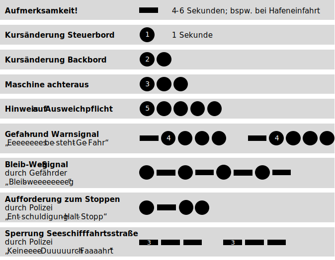
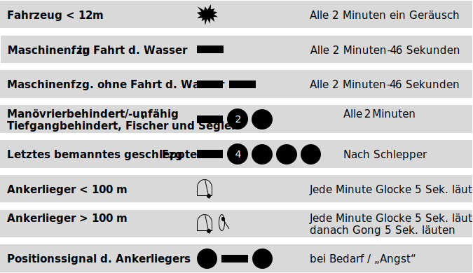

## Tonnenkennungen

## Sichtzeichen

## Schallsignale bei Sicht

## Schallsignale bei verminderter Sicht

## Quellen

* [SBF-Videokurs.de](https://sbf-videokurs.de) (Die App ist wirklich gut!)
* [sbfSee.de](https://www.sbfsee.de/theorie/sichtzeichen)
* [SBF-Lehrgang.de](http://www.sbf-lehrgang.de/lehrgang/see02/see2_4.html)
